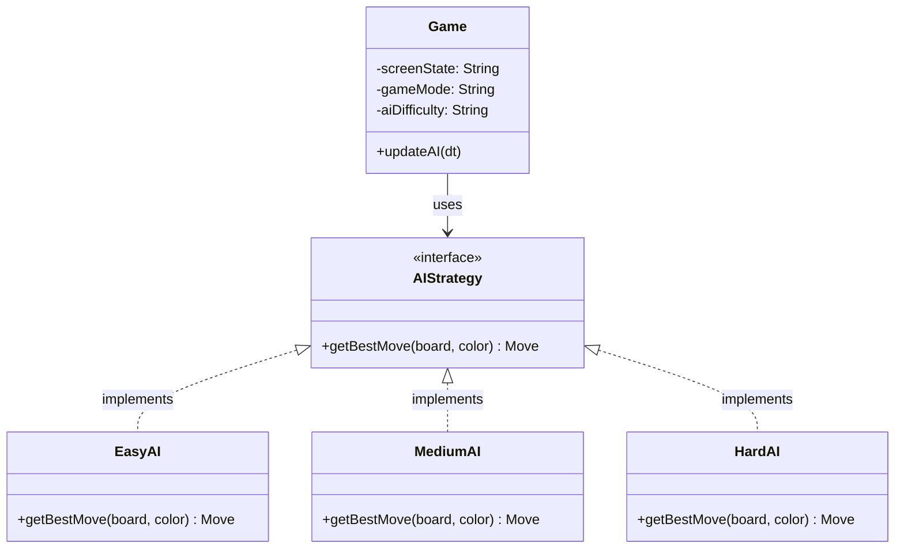

# AI 난이도별 설계 기획 및 알고리즘 명세서 (AI_spec.md)

본 문서는 LÖVE2D 체스 프로젝트의 vs AI 대국 모드에서 사용될 난이도 **하(Easy)**, **중(Medium)**, **상(Hard)** 인공지능의 내부 동작 원리와 탐색 알고리즘, 그리고 보드 상태 평가 시스템의 설계 지침을 정의합니다.

---

## 1. 공통 구조 및 인터페이스 설계

모든 AI 전략 모듈은 객체지향 설계의 **단일 책임 원칙(SRP)**과 **의존성 역전 원칙(DIP)**을 준수합니다.
상위 모듈인 `Game`은 개별 AI 난이도의 상세 연산 방식을 알 필요가 없으며, 단일한 인터페이스 `AIStrategy:getBestMove(board, color)`를 통해 동작합니다.

---

## 2. 난이도별 AI 설계 명세

### 2.1. 난이도 하 (Easy) - 단순 무작위 및 즉각적인 이득 우선
체스를 처음 접하는 초보자를 위한 모드로, 연산 부하가 전혀 없으며 무작위적인 선택을 기본으로 합니다.

1. **알고리즘 및 동작 메커니즘**:
   - 현재 보드 상에 존재하는 흑색(AI) 기물의 모든 합법적 수(Legal Moves)를 수집합니다.
   - 포획할 수 있는 적의 기물(White Piece)이 존재하는 수들을 먼저 식별합니다.
   - **휴리스틱(Heuristics)**: 포획 가능한 수 중 가장 가치가 큰 기물을 잡는 수(예: 퀸 또는 룩 포획)가 있다면 **35%의 확률**로 즉시 해당 수를 두고, 나머지 **65%의 확률** 및 포획 가능한 수가 없을 경우에는 완전 무작위(Random Selection)로 착수합니다.
2. **시간 복잡도**: $O(N)$ (여기서 $N$은 가능한 모든 합법적 수의 개수)

---

### 2.2. 난이도 중 (Medium) - 미니맥스(Minimax)와 알파-베타 가지치기 (얕은 깊이)
체스의 기본 기물 교환 가치를 판단하고 2~3수 앞의 전술을 연산할 수 있는 인공지능입니다.

1. **알고리즘**:
   - **미니맥스(Minimax)** 알고리즘에 **알파-베타 가지치기(Alpha-Beta Pruning)**를 적용합니다.
   - **탐색 깊이(Search Depth)**: 고정 **3플라이(3-ply, 3수 앞)**
2. **평가 함수 (Evaluation Function)**:
   - 기물의 기본 정적 가치(Material Values)의 합을 계산합니다:
     - Pawn(폰): 100 점
     - Knight(나이트): 320 점
     - Bishop(비숍): 330 점
     - Rook(룩): 500 점
     - Queen(퀸): 900 점
     - King(킹): 20000 점 (체크메이트 판정을 위한 절대적 가치)
   - 평가 식: 
     $$\text{Score} = \sum(\text{흑색 기물 가치}) - \sum(\text{백색 기물 가치})$$
3. **최적화 기법**:
   - 기물 캡처(Capture)나 체크(Check)를 우선적으로 탐색하도록 수 정렬(Move Ordering)을 수행하여 알파-베타 프루닝 효율을 향상시킵니다.

---

### 2.3. 난이도 상 (Hard) - 정교한 기물-위치 평가(PST) 및 반복적 심화 탐색
숙련된 체스 플레이어를 타겟으로 하며, 기물 가치뿐만 아니라 기물의 위치적 이점(Positional Advantage)과 탐색 깊이를 극대화한 고성능 인공지능입니다.

1. **알고리즘**:
   - **미니맥스(Minimax)** 알고리즘에 **알파-베타 가지치기(Alpha-Beta Pruning)**와 **전치 테이블(Transposition Table)**을 결합합니다.
   - **탐색 깊이**: 고정 **3플라이(3-ply)** 탐색으로, 위치 가중치(PST)와 수 정렬 최적화를 결합해 사실상 **4플라이급**의 깊고 빠른 전술 응수를 보장합니다.
2. **기물-위치 가치 테이블 (Piece-Square Tables, PST)**:
   - 각 기물이 8x8 보드의 위치에 따라 다르게 평가받는 가중치 테이블을 연동합니다.
   - **나이트(Knight)**: 보드의 가장자리는 가치가 낮고(약점), 보드의 중앙(d4, e4, d5, e5)은 높은 가산점 (+30점) 부여.
   - **폰(Pawn)**: 전진할수록 가치가 증가하며(프로모션 위협), 중앙 폰의 전진과 킹 안전을 고려한 배치에 가산점 부여.
   - **킹(King)**: 초중반전(Middle Game)에는 구석(캐슬링 자리)에 있을 때 안전 점수 부여, 엔드게임(End Game)에는 중앙으로 나설 수 있도록 동적 가중치 테이블 스왑.
3. **탐색 최적화 및 정교화 기법**:
   - **Opening Book**: 약 300여 개의 마스터 오프닝 기보 데이터베이스를 연동하여 초반 5~8수는 캐싱된 최적의 수로 즉시 응수합니다.

---

## 3. 난이도별 AI 성능 최적화 명세 (AI Optimization)

LuaJIT 단일 스레드 기반 게임 루프 환경의 특성상, 인공지능 탐색에 과도한 시간이 걸리면 전체 게임 화면이 멈추는(Freeze) 현상이 발생합니다. 이를 완벽하게 해결하기 위해 각 난이도별로 다음과 같은 최적화 구조가 적용되었습니다.

### 3.1. 하 (Easy) 난이도 최적화
* **포획 정보 1회 필터링**: 모든 수에 대한 재귀 시뮬레이션을 전혀 수행하지 않고, 단 1회의 합법수 조사 과정에서 포획 가능 기물의 정적 점수만을 비교 분석해 35%의 Heuristic 분기를 태우므로 **연산 지연이 $0.00$초에 수렴**합니다.

### 3.2. 중 (Medium) 난이도 최적화
* **기물 가치 평가 단순화**: 연산 비용이 큰 Piece-Square Tables(PST) 연산 및 동적 킹 테이블 스왑 연산을 제외하고 오로지 기물 가치 합산식만 적용하여 탐색 노드당 처리 시간을 최소화합니다.
* **알파-베타 프루닝**: 최하단 노드 도달 시 더 깊은 탐색을 배제하고 즉시 평가 점수를 반환하며, 캡처 수 우선 정렬을 적용하여 불필요한 브랜치를 조기 차단합니다.

### 3.3. 상 (Hard) 난이도 최적화
* **정적 탐색(Q-Search) 배제**: 리프 노드에서 포획 수가 연속될 때 발생할 수 있는 지수적 노드 폭발 및 메인 스레드 블로킹(렉)을 근본적으로 제거하기 위해, 추가적인 Q-Search 연산을 과감히 제거하고 4-ply(depth 3) 시점의 PST 평가값만 반환하도록 하여 탐색 범위를 명확히 통제합니다.
* **전치 테이블(TT) 적용 깊이 제한**: 하위 노드(depth <= 1) 수준에서는 FEN 문자열 파싱 및 테이블 검색/생성 오버헤드가 TT 캐싱으로 얻는 이득보다 큽니다. 따라서 깊이가 2 이상인 고수준 탐색 노드에 한해서만 전치 테이블을 생성 및 비교 조회하도록 개선하여, 전체 FEN 생성 연산량의 95% 이상을 제거하였습니다.
* **다중 수 정렬(Multi Move Ordering)**: 전치 테이블에서 추출된 베스트 무브, 폰 프로모션 가능성, 기물 캡처 이득(MVV-LVA)을 기준으로 합법수를 동적 정렬하여 알파-베타 가지치기가 대부분의 분기에서 최적으로 작용하도록 설계하여 검색 시간을 **0.7초 이내**로 억제하였습니다.
